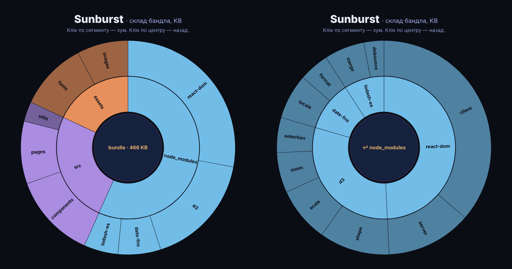

# Sunburst

Zoomable sunburst на D3: ієрархія кільцями, клік по сегменту розгортає його на все коло, клік по центру — назад.
Дані — умовний склад JS-бандла в KB (`src/data.js`), заміни на свої.

> Пост [@nby.frontend](https://instagram.com/nby.frontend) #207 · ключ `Sunburst`



## Запуск

```bash
npm i && npm run dev
```

## Як це працює

1. `d3.hierarchy(data).sum(d => d.value)` — сумує значення від листків до кореня.
2. `d3.partition().size([2π, height + 1])` — кожному вузлу дає `x0/x1` (кут) і `y0/y1` (рівень).
3. `d3.arc()` малює сегмент: кут з `x`, радіуси з `y × r`.
4. `zoom(p)` перераховує `x/y` усіх вузлів відносно `p` і анімує перехід через `attrTween`.
   Видно лише 2 кільця (`y` від 1 до 3) — глибші рівні з'являються після зуму.

## Файли

- `src/data.js` — дані
- `src/sunburst.js` — розмітка, дуги, зум
- `src/main.js` — точка входу
- `src/style.css` — Tokyo Night стилі

---

EN: Zoomable D3 sunburst — click a segment to zoom in, click the center to go back. `npm i && npm run dev`.
